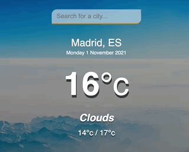

# WEATHER APP

Weather APP is an application built with HTML, CSS and Vanilla JavaScript that loads data from a weather API and enables viewing of weather information from different cities.

Users can search for different cities to see current temperature, maximum and minimun for the day and weather definition. They will also see the day and date on the screen. The API used for this project is the [Current Weather data from Open Weather Map](https://openweathermap.org/api).

**See the hosted application [here](https://tanimaraeliassantos.github.io/weather-app/).**

## Feature

- Loads data from Open Weather Map API
- Changes data on keypress

## Technologies

- HTML
- CSS
- JavaScript

### Author

[Tanimara Elias Santos](https://github.com/tanimaraeliassantos)

### Version

1.0.0
